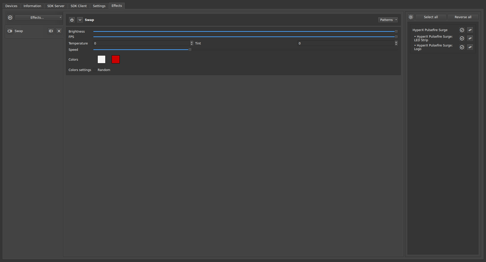

# OpenRGB

I use a keyboard and mouse from a manufacturer that unfortunately does not make
software for Linux based systems. So I use the excellent
[OpenRGB](https://github.com/CalcProgrammer1/OpenRGB) solution, with
[Effects Plugin](https://openrgb.org/plugins.html) to control the backlighting
of the devices.

