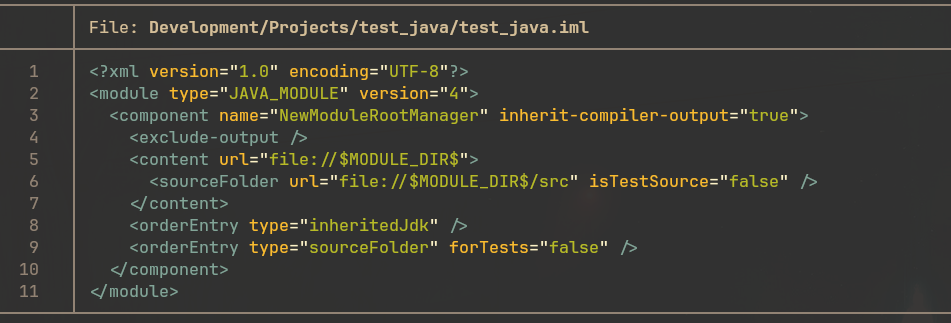

# bat

[bat](https://github.com/sharkdp/bat) is a nice modern replacement for cat,
which supports syntax highlighting and is generally much nicer to work with.

Use the **cat** alias to invoke this command.

