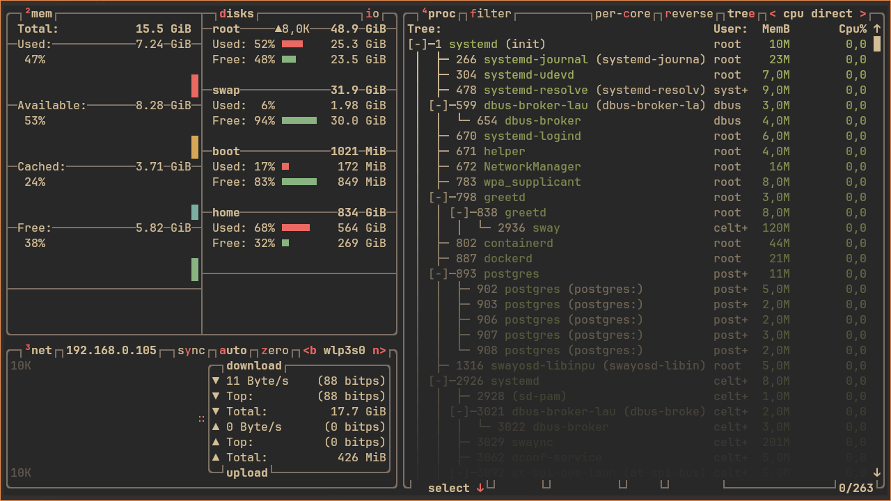

# btop

[btop](https://github.com/aristocratos/btop/) is an improved version of top.
This utility allows me to control processes in my system and monitor its state
quite conveniently.

You can run it by left click on the CPU module on the waybar.

