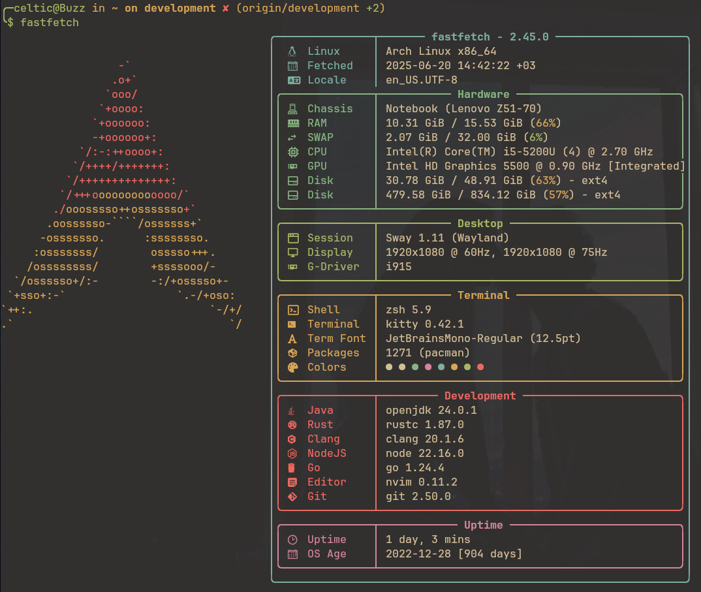

# fastfetch

[fastfetch](https://github.com/LinusDierheimer/fastfetch) is a lightning‑fast,
C‑based system info tool designed as a streamlined Neofetch alternative. In just
a few milliseconds it gathers and displays key details—OS, CPU, GPU, RAM, disks,
and more—alongside your distro’s logo or custom ASCII art. Fully modular and
configured via a simple JSON file, Fastfetch lets you pick exactly which modules,
colors, and layouts you want, without pulling in heavy dependencies.
Perfect for quick diagnostics, login greetings, or screenshot-ready setups.

Previously I had used [neofetch](https://github.com/dylanaraps/neofetch) but it
to old and not so fast. You can find my [neofetch config here](../../neofetch/config.conf).

