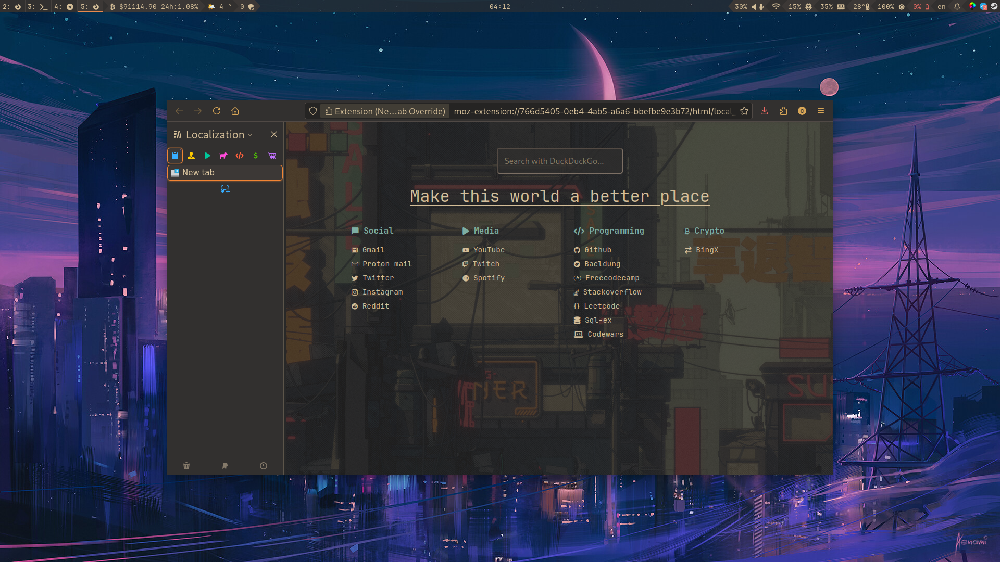
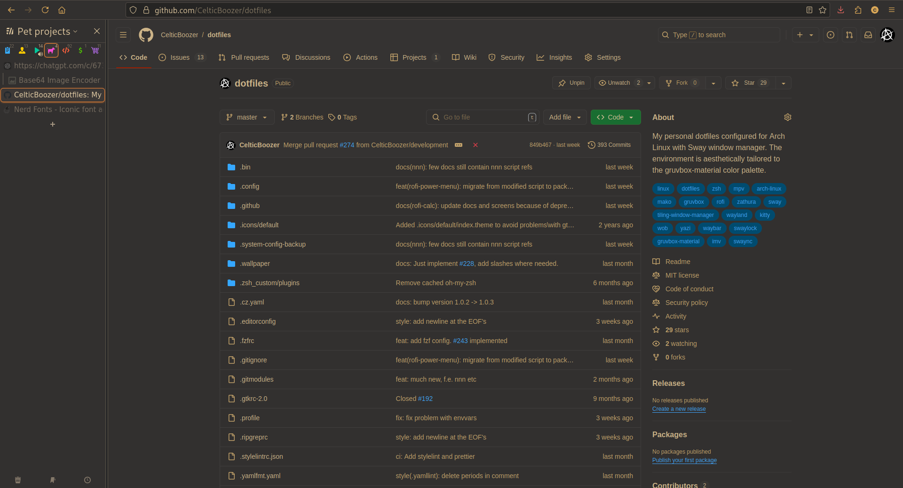

# Firefox

I prefer to use Firefox developer edition as my primary browser.
Main features of this config:

- :bookmark_tabs: Vertical tabs.
- :paintbrush: Gruvbox-material style.
- :racing_car: Pretty fast.
- :closed_lock_with_key: Security oriented.
- :sparkles: Much more...

:briefcase: List of extensions:

- [Vimium](https://github.com/philc/vimium)
- [New Tab Override](https://github.com/cadeyrn/newtaboverride)
- [Turbo Download Manager](https://github.com/inbasic/turbo-download-manager)
- [Improve Youtube](https://github.com/code-charity/youtube) [:gear:](../extensions/improvedtube.json)
- [keePassXC-Browser](https://github.com/keepassxreboot/keepassxc-browser)
- [uBlock Origin](https://github.com/gorhill/uBlock) [:gear:](../extensions/ublock.json)
- [Sidebery](https://github.com/mbnuqw/sidebery) [:gear:](../extensions/sidebery.json)
- [Auto Tab Discard](https://github.com/rNeomy/auto-tab-discard) [:gear:](../extensions/auto-tab-discard.json)
- [Metamask](https://github.com/MetaMask/metamask-extension)
- [Dark Reader](https://github.com/darkreader/darkreader) [:gear:](../extensions/dark-reader.json)
- [Firefox Color](https://github.com/mozilla/FirefoxColor)

## :hammer_and_wrench: Setup

### :package: Theme installation

You can find my [theme here](https://shorturl.at/kqHuq).

### :package: Firefox custom settings installation

**user.js** - my user.js file based on [BetterFox](https://github.com/yokoffing/Betterfox).
copy it to the root folder of your profile.

**userChrome.css** - my css file to disable horizontal tabs. Copy it to the
your profile **root/chrome/** folder.

Do not forget to configure [NextDNS](https://nextdns.io).

### :package: Extensions installation and configuration

Most extensions allow you to import settings in json format, you can find them
in the extensions folder.

However, here are some tips for some plugins:

- Dark Reader - for the extension to work correctly on sites with dark theme,
if possible - disable it.
- New Tab Override - import start.html as local file.

