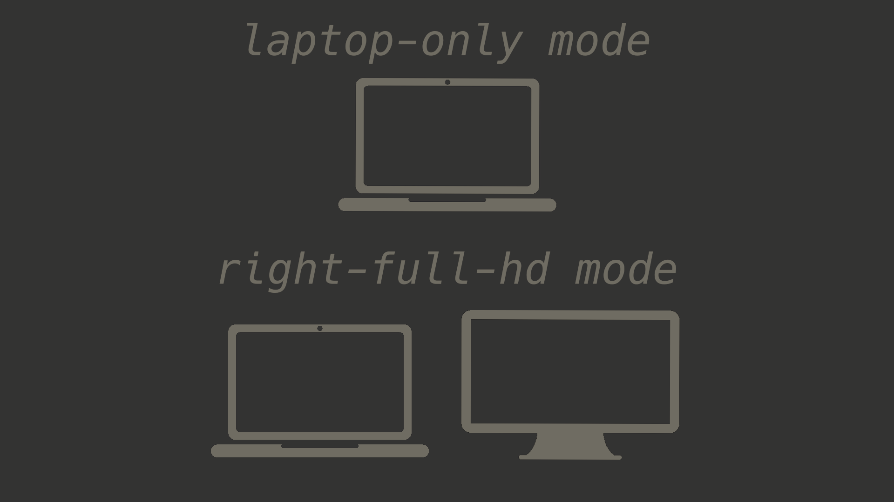

# kanshi

I use [kanshi](https://sr.ht/~emersion/kanshi/) for convenient multiscreen
operation and easy switching in case of configuration changes.

It currently works in two modes.

> I suppose that you should fully customize this program for yourself, taking
  into account the convenient position of external monitors and their names.
