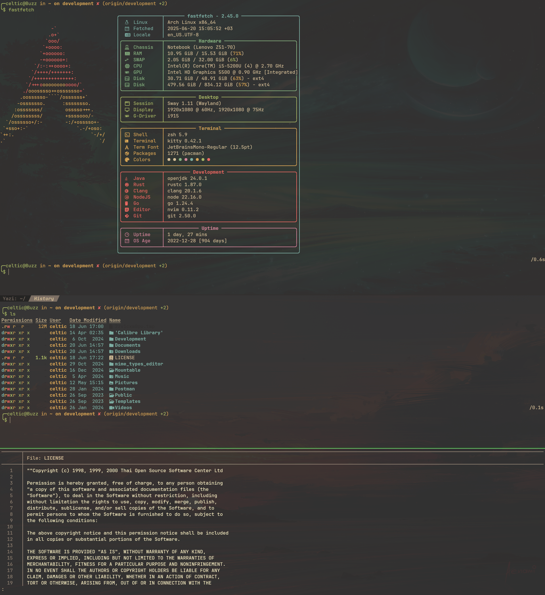

# kitty

[kitty](https://github.com/kovidgoyal/kitty/) is a terminal emulator, it is
extremely fast, convenient, customizable. The most important thing for me is
that it supports tabs, tiles and image preview. Also this emulator is fully
customizable.

You can execute kitty, using the `Win+Return` hotkey.

## Hotkeys

I tried to configure the hotkeys in the style of my sway configuration and
added some vim-like hotkeys.

| Function                  | Hotkey              |
|---------------------------|---------------------|
| mod                       | ctrl+shift          |
| Copy text to clipboard    | mod+Shift+c         |
| Paste text from clipboard | mod+Shift+v         |
| Scroll line up            | mod+up, mod+k       |
| Scroll line down          | mod+down, mod+j     |
| Scroll page up            | mod+page_up         |
| Scroll page down          | mod+page_down       |
| Scroll home               | mod+home            |
| Scroll end                | mod+end             |
| Show last command output  | mod+g               |
| New window                | mod+enter           |
| Close window              | mod+w               |
| Next window               | mod+]               |
| Previous window           | mod+[               |
| Resize window             | mod+r               |
| Go to window [0-9]        | mod+[0-9]           |
| New tab                   | mod+t               |
| Next tab                  | ctrl+tab            |
| Previous tab              | mod+tab             |
| Close tab                 | mod+q               |
| Move tab forward          | mod+.               |
| Move tab backward         | mod+,               |
| Set tab title             | mod+l               |
| Go to tab [0-9]           | ctrl+alt+[0-9]      |
| Increase font size        | mod+equal, mod+plus |
| Reduce font size          | mod+minus           |
| Reset font size           | mod+backspace       |
| Edit config file          | mod+f2              |
| Reload config file        | mod+f5              |
| Debug config              | mod+f6              |
