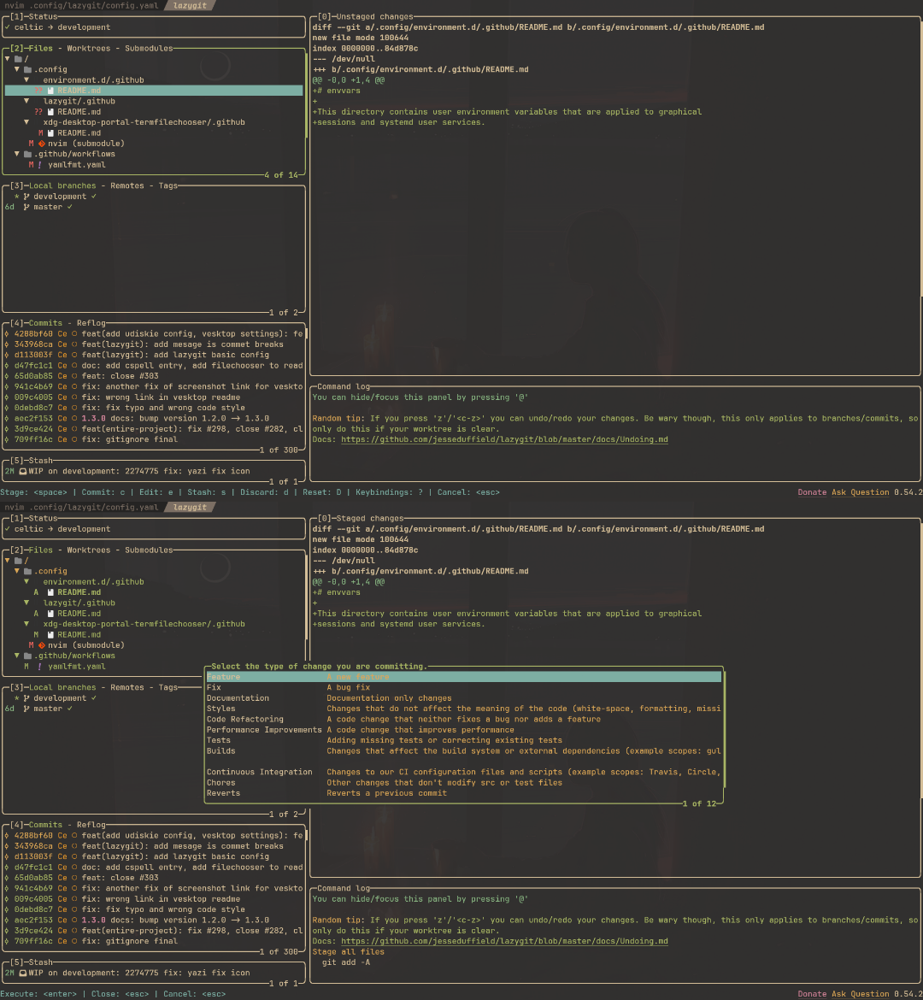

# lazygit

lazygit is a simple terminal UI for git commands, it offers a fast and easy way
to do git operations. Also it compatible with
[conventional commits](https://www.conventionalcommit.org/en/).

