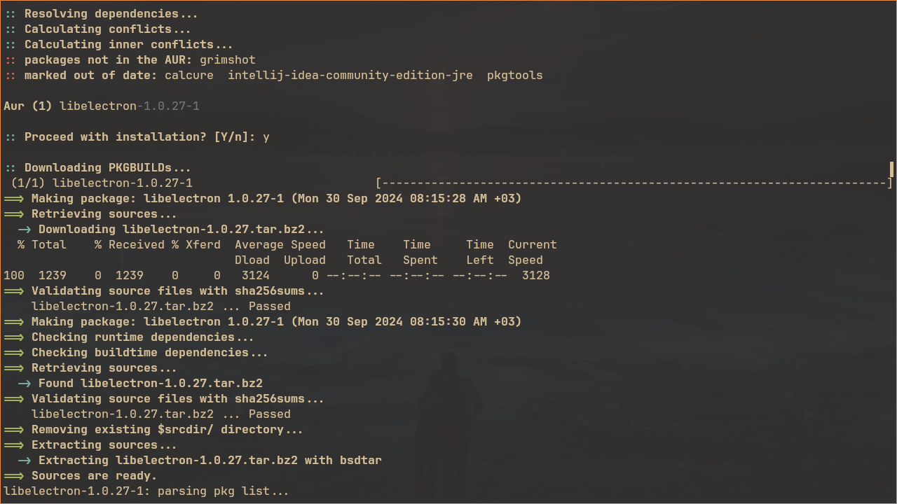

# paru

[paru](https://github.com/Morganamilo/paru/) is an AUR helper for Arch Linux,
used to easily install, manage, and update packages from both the official
repositories and the AUR. It is a modern, Rust-based alternative to other AUR
helpers like yay, with additional features like improved performance and more
customization options.

I configured it to conveniently install packages exclusively from AUR.

