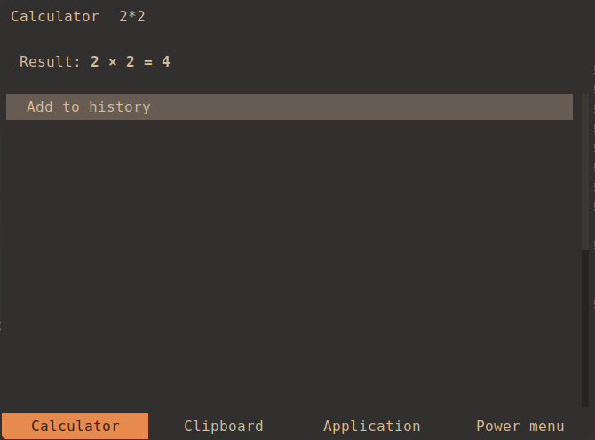
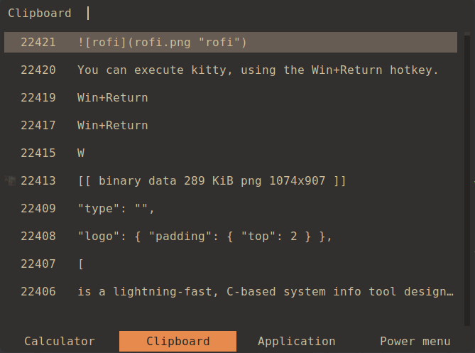
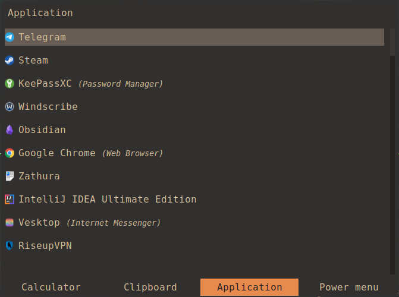
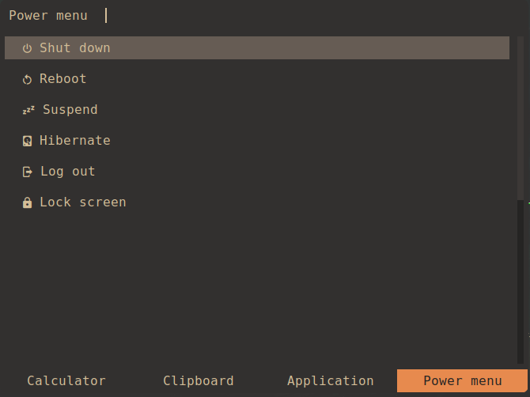

# rofi

[rofi](https://github.com/davatorium/rofi/) is a lightweight, highly customizable
application launcher. It allows users to quickly search and launch applications,
and execute custom commands from a simple, searchable menu interface.

Unfortunately, the original rofi doesn't support Wayland. Therefore, I use the
[Wayland fork](https://github.com/lbonn/rofi/).

To execute rofi use hotkey `Win+d`.

## Modes

- [rofi-calc](https://github.com/svenstaro/rofi-calc) is rofi's mode as a
  calculator.

  

- [rofi-cliphist](https://github.com/sentriz/cliphist/) is rofi's mode as a
  clipboard manager with image support.

  

- rofi-drun is rofi's mode as an application launcher.

  

- [rofi-power-menu](https://github.com/jluttine/rofi-power-menu/) is rofi's mode
  as a power manager.

  
