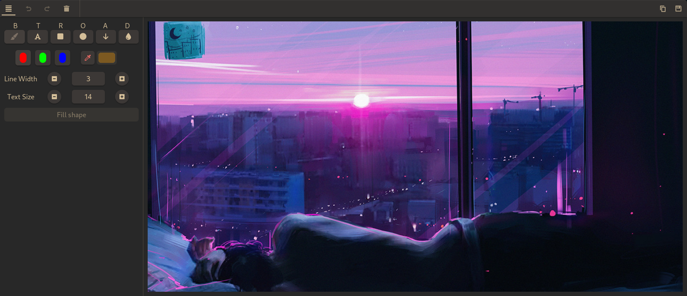

# Swappy

[Swappy](https://github.com/jtheoof/swappy) is a great, Wayland native snapshot
and editor tool. It works with [grim](https://github.com/emersion/grim).

You can run it via the hotkeys:

- Print Screen - select a screen region.
- Win + Print Screen - screenshot of the current window.
- Win + Shift + Print Screen - screenshot of the entire screen.

NOTE: If you save a screenshot, it is automatically saved named by the timestamp
to the $HOME/.screenshot/ directory.

