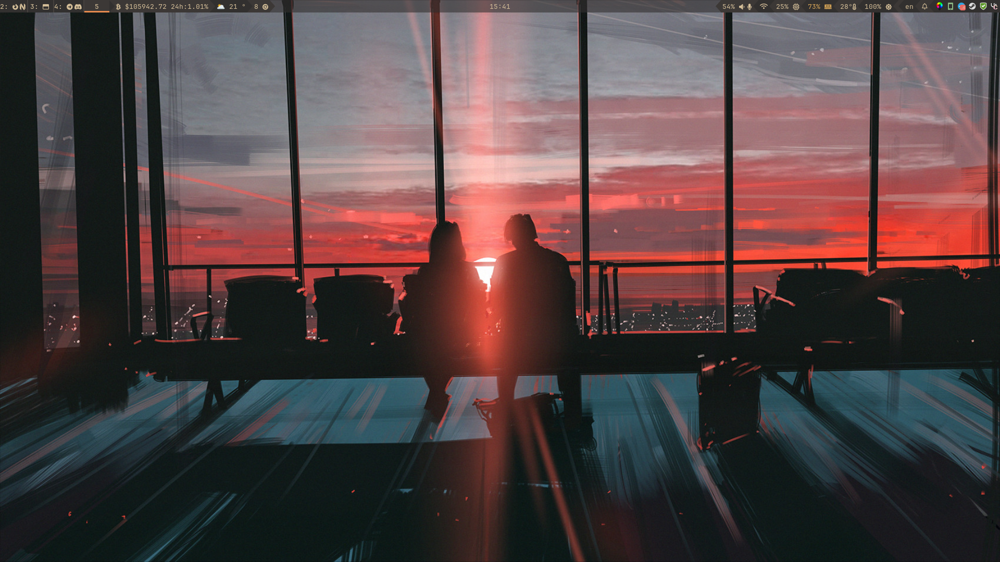

# Sway

[Sway](https://github.com/swaywm/sway) Window Manager is a tiling window manager
and a drop-in replacement for i3, built specifically for the Wayland display
server. I chose it because of: lightweight, tiling, customization, minimalizm.

## Configuration tree

Instead of configuring the entire window manger in a single file, I chose the
modular configuration path.

Files list:

- **config** - the basic configuration file which contains the inclusion of all
  specific files and the assignment of the most necessary settings.
- **config.d/daemons.conf** - running all necessary background processes.
- **config.d/floating.conf** - rules of behavior of floating windows.
- **config.d/input.conf** - settings for input devices such as keyboard and touchpad.
- **config.d/keybinds.conf** - keybind settings.
- **config.d/theme.conf** - colorscheme, themes and other visual settings.
