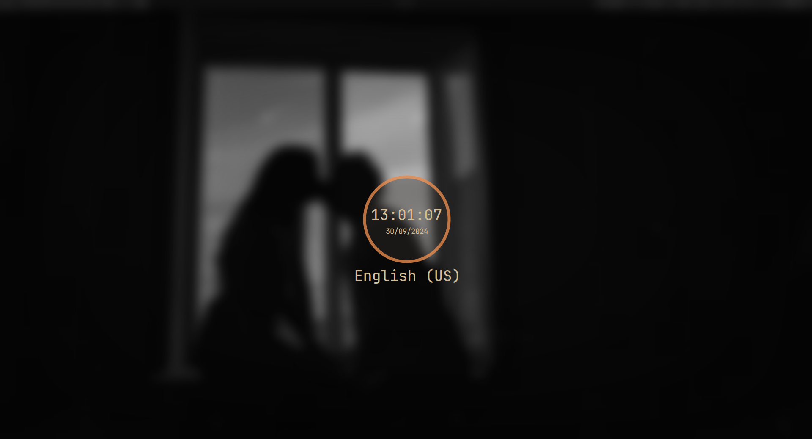

# swaylock

[swaylock](https://github.com/swaywm/swaylock/) is a screen locker for the SwayWM.
It locks the screen, requiring the to enter password to unlock it.

Unfortunately, the original project doesn't support screenshots and dimming.
That's why I chose [swaylock-effect](https://github.com/mortie/swaylock-effects/),
however this project was abandoned by the author, so I'm using a
[supported fork](https://github.com/jirutka/swaylock-effects/).

To execute swaylock use hotkey `Win+Esc`.

