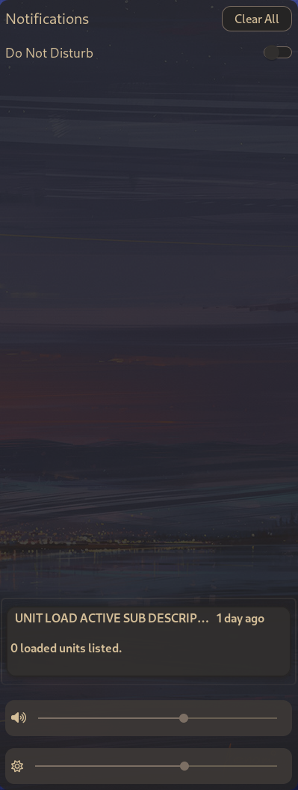

# SwayNC

[SwayNC](https://github.com/ErikReider/SwayNotificationCenter/) - is a notification
center and daemon designed specifically for the Sway window manager and other
Wayland-based environments. It's pretty lightweight, fast, and functional. Its
main advantage is the availability of a full-fledged notification center.

> As an alternative to SwayNC you can use my configuration for
  [mako](https://github.com/CelticBoozer/dotfiles/tree/master/.config/mako/).

To execute swaync use hotkey `Win+n`.

