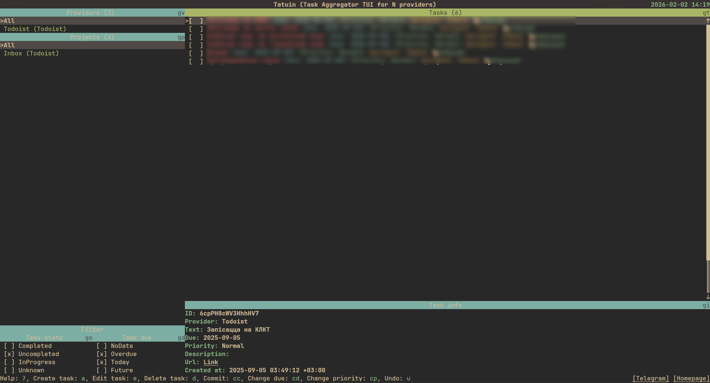

# Tatuin

[Tatuin](https://github.com/panter-dsd/tatuin) is a simple, fast and pretty TUIUtask agreagtor.
I'm using it to manage my tasks in todoist.

My config contains only theme, that I took from [here](https://github.com/panter-dsd/tatuin/tree/master/assets/themes).
Please, after the installation, create a new settings.toml file and add the following lines:

`theme = "gruvbox-material-dark"`

Also do not forget to connect your todoist account to tatuin.

