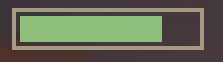
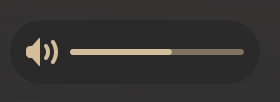

# wob

[wob](https://github.com/francma/wob/) overlay volume/backlight/progress/anything
bar for wlroots. It's fast and lightweight, but it doesn't support keystroke
events, only volume and brightness changes. So I stopped using it and switched
to SwayOSD. However, you can still use my configuration for wob.

> [SwayOSD](https://github.com/ErikReider/SwayOSD/) provides on-screen display
  (OSD) notifications for various events, f.e. volume and brightness changes,
  Caps Lock status changes etc.

