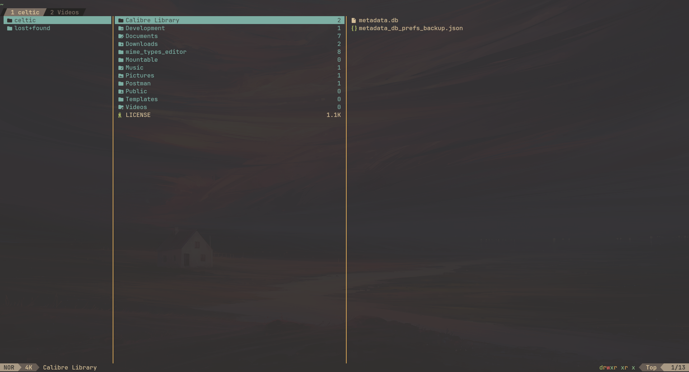

# yazi

[yazi](https://github.com/sxyazi/yazi/) is an awesome file manager. Fast, similar
to vim, beautiful, easy to customize. That's why I chose it as my primary file
manager.

## Keymap

You can find the key map in the [documentation](https://yazi-rs.github.io/docs/quick-start/),
the default key map is similar to vim, so I didn't change it.
