# Linux dotfiles
Greetings, thanks for stopping by here. I tried to make a lightweight system based on Arch Linux,
[SwayWM](https://github.com/swaywm/sway) and Unix way(mostly) approach. As the main theme of the system and all
programs, I chose the [gruvbox](https://github.com/morhetz/gruvbox) because of the pleasant palette for me and the
absence of acidic colors, because I have to work for hours every day. I have tried to make a similar control wherever
I could. To see full packages list - see .pkglist.txt.

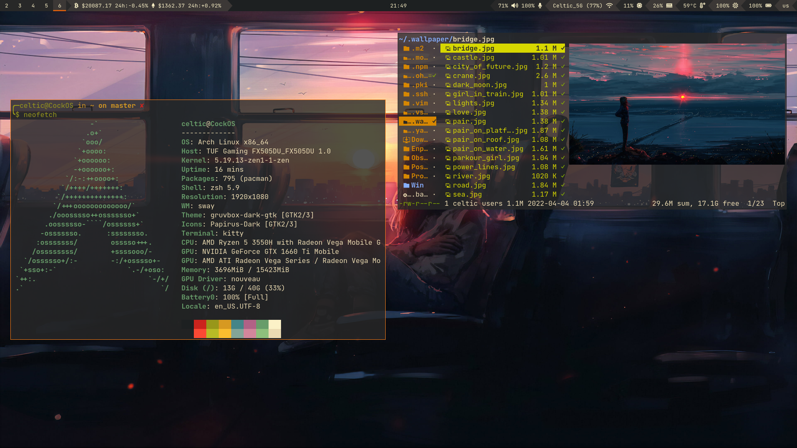
***
## Distro
I chose Arch Linux as a distribution because of its powerful pacman package manager, full customizability to my needs,
strong community and rolling release model, thanks to which I receive continuous system updates.
## Kernel
I chose the [linux-zen](https://github.com/zen-kernel/zen-kernel) kernel, because it has a large number of patches that
imperceptibly improve the system.
## Pacman
Pacman configured.
Move

    .pacman/create-backup.hook to /usr/share/libalpm/hooks
    .pacman/pacman.conf to /etc/pacman.conf
Package list u can find in .pkglist.txt
## AUR helper
Most Arch Linux users use so-called AUR helpers to simplify the installation of packages from AUR. I chose
[paru](https://github.com/Morganamilo/paru) because it is a very powerful AUR helper, its syntax is similar to the
syntax of the pacman itself, it is not abandoned and it is easy to customize.
## Shell
I replaced the base shell (bash) with zsh. Zsh contains a huge number of user interaction improvements such as themes,
plugins, etc.

For the convenience of configuring the zsh, I use the framework [oh-my-zsh](https://github.com/ohmyzsh/ohmyzsh). Just
follow the [installation guide](https://github.com/ohmyzsh/ohmyzsh/blob/master/README.md).

List of plugins:
- [fast-syntax-highlighting](https://github.com/zdharma-continuum/fast-syntax-highlighting);
- [zsh-autosuggestions](https://github.com/zsh-users/zsh-autosuggestions);
- sudo;
- copypath;
- copyfile;
- dirhistory;
- archlinux;
- vi-mode;
- timer.

To install the first two plugins, clone them to ~/.oh-my-zsh/custom/plugins/. As the theme I chose strug.
## Terminal emulator
I chose [kitty](https://github.com/kovidgoyal/kitty) as the terminal emulator. This is one of the best terminal
emulators in my opinion, besides it supports images preview and ligatures.

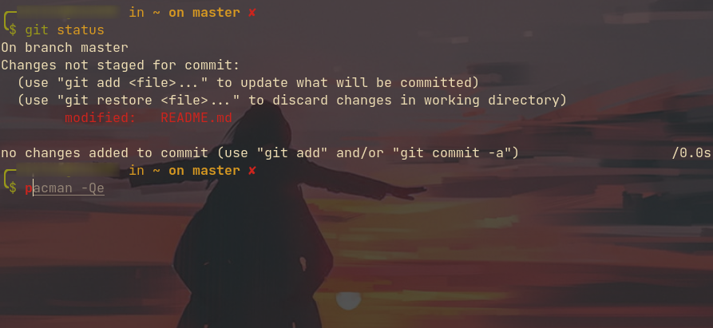

Also, just for fun I've use [cool-retro-term](https://github.com/Swordfish90/cool-retro-term).

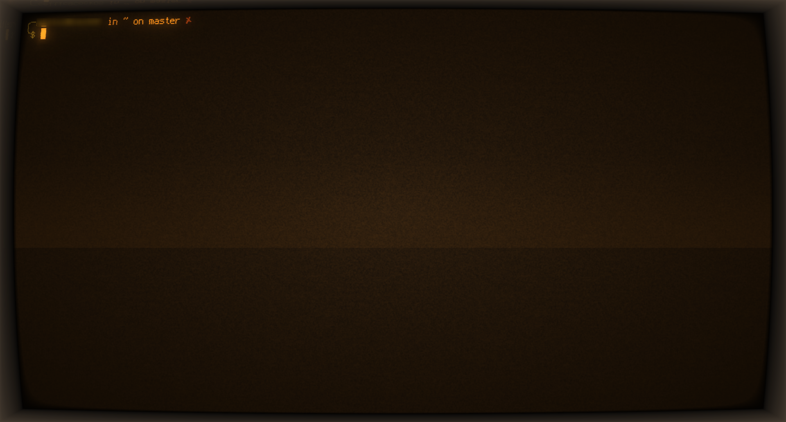
## WM
Sway configured with all needed daemons and hotkey configs.

List of daemons/background tasks:
- [swayidle](https://github.com/swaywm/swayidle);
- [mako](https://github.com/emersion/mako);
- [wlsunset](https://github.com/kennylevinsen/wlsunset);
- [swaykbdd](https://github.com/artemsen/swaykbdd);
- [easyeffects](https://github.com/wwmm/easyeffects);
- [kanshi](https://github.com/emersion/kanshi);
- ~/.bin/randomBackground.sh.

[xcursor-simp1e-gruvbox-dark](https://gitlab.com/zoli111/simp1e/) is used as the cursor theme, and 
[papirus-icon-theme](https://github.com/PapirusDevelopmentTeam/papirus-icon-theme) is used for icons, and
[gruvbox-dark-gtk](https://github.com/jmattheis/gruvbox-dark-gtk) is used as gtk apps theme.

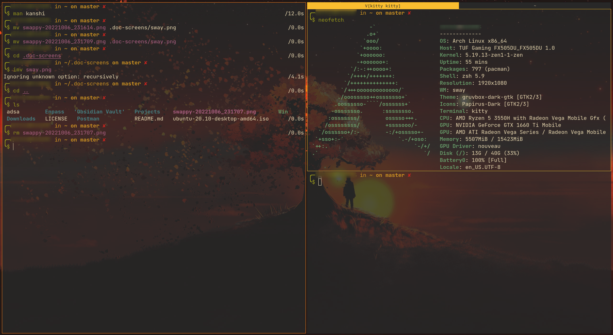
## Bar
[Waybar](https://github.com/Alexays/Waybar) is the best Wayland native bar. Configured in gruvbox theme and airline
style. Some of the plugins - is clickable.

List of plugins:
- sway/workspaces;
- [custom/crypto](https://github.com/chadsr/waybar-crypto);
- sway/mode;
- pulseaudio: left-click - Volume Control, right-click - EasyEffects;
- network: left-click - [nmtui](https://github.com/heftig/NetworkManager);
- cpu: left-click - [btop](https://github.com/aristocratos/btop);
- memory;
- temperature;
- backlight;
- battery;
- sway/language;
- tray;

## Notification daemon
Mako is a well-known notification daemon. Very useful with any messanger/browser etc...

## Overlay bar
[Wob](https://github.com/francma/wob) - is overlay bar, to visualize volume/brightness changes.

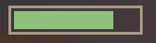
## Screen lock
[Swaylock-effects](https://github.com/jirutka/swaylock-effects) - is a great screen locking utility.

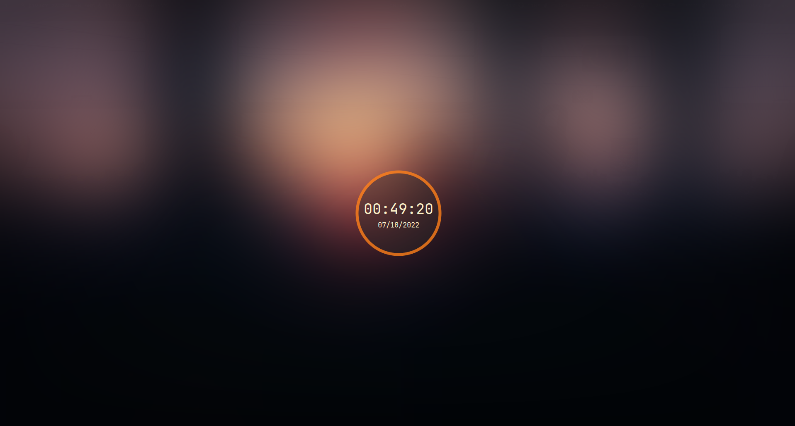
## File manager
[Ranger](https://github.com/ranger/ranger) - one of the best console file managers. Easy to install plugins.

List of plugins:
- [ranger-archives](https://github.com/maximtrp/ranger-archives);
- [ranger_devicons](https://github.com/alexanderjeurissen/ranger_devicons);
- [ranger_udisk_menu](https://github.com/SL-RU/ranger_udisk_menu).

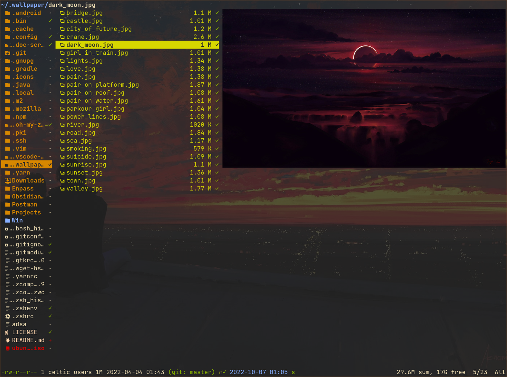
## Application launcher
[Rofi](https://github.com/davatorium/rofi) - is a famous and powerful application launcher, but I've used for
[rofi-lbonn](https://github.com/lbonn/rofi) because of native Wayland support.

List of plugins:
- [rofi-calc](https://github.com/svenstaro/rofi-calc);
- [rofi-power-menu](https://github.com/jluttine/rofi-power-menu);
- [rofi-bluetooth](https://github.com/nickclyde/rofi-bluetooth).

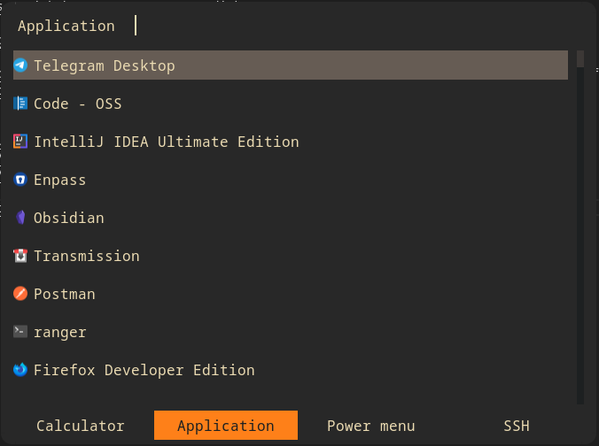
## Audio
[Pipewire](https://gitlab.freedesktop.org/pipewire/pipewire) - is a new low-level multimedia framework. Easy to
manage and absolutely compatible with ALSA and Pulse.

Also, EasyEffects used to manage audio quality. Presets based on
[this](https://github.com/JackHack96/EasyEffects-Presets) and
[this](https://gist.github.com/MateusRodCosta/a10225eb132cdcb97d7c458526f93085).

## Document viewer
[Zathura](https://github.com/pwmt/zathura) - cool lightweight document viewer.

## System monitor
Btop - is a lightweight and powerful system monitor.

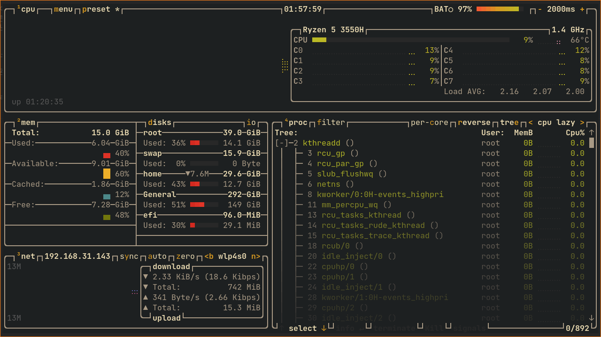

## Screenshoter

Grimshot + [swappy](https://github.com/jtheoof/swappy) - default sway screen capture + lightweight editor.

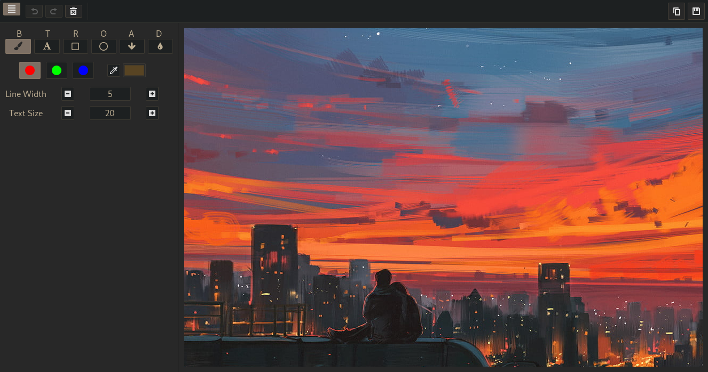

## Organizer

[Calcurse](https://github.com/lfos/calcurse) - console calendar and scheduling application.

## Image viewer
[Imv](https://github.com/eXeC64/imv) - one of the best image vewers for Wayland.

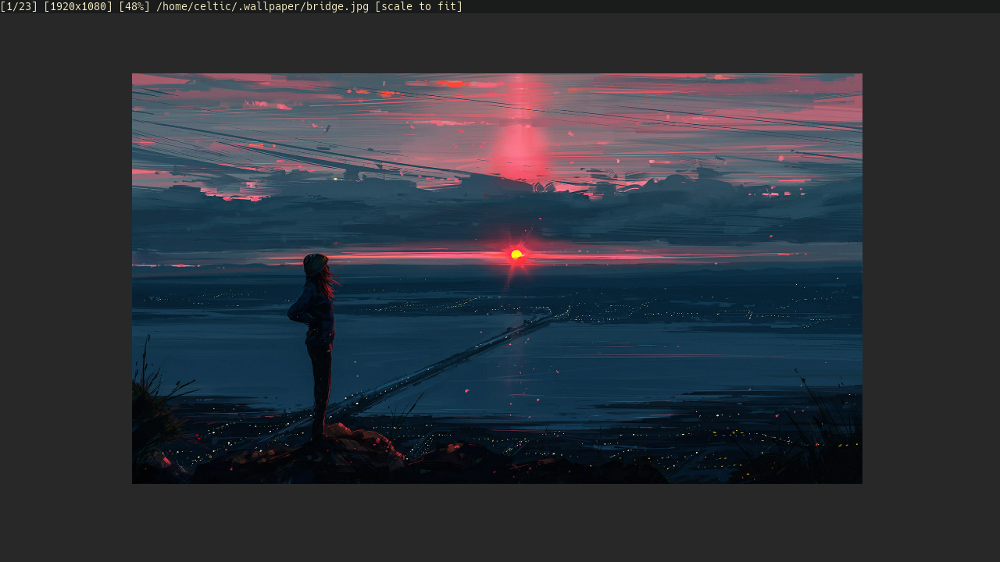
